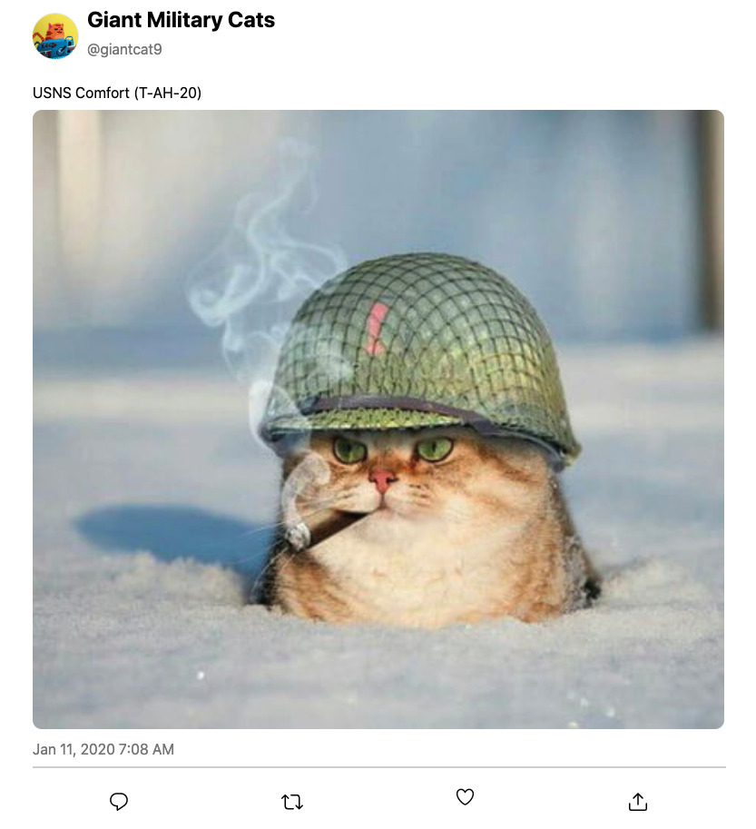
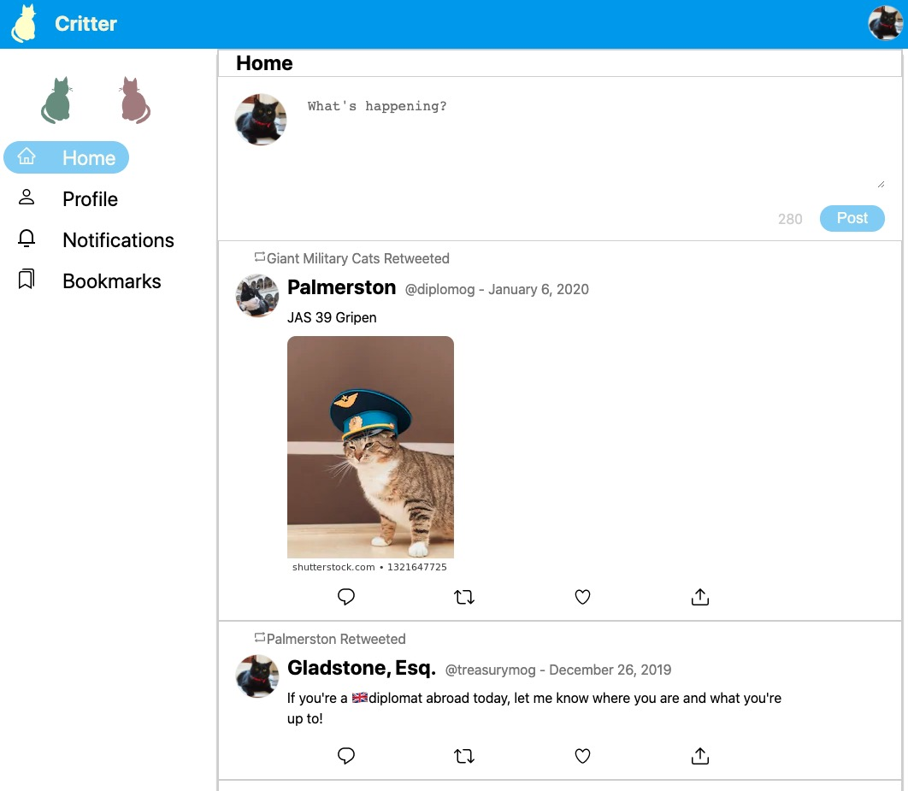
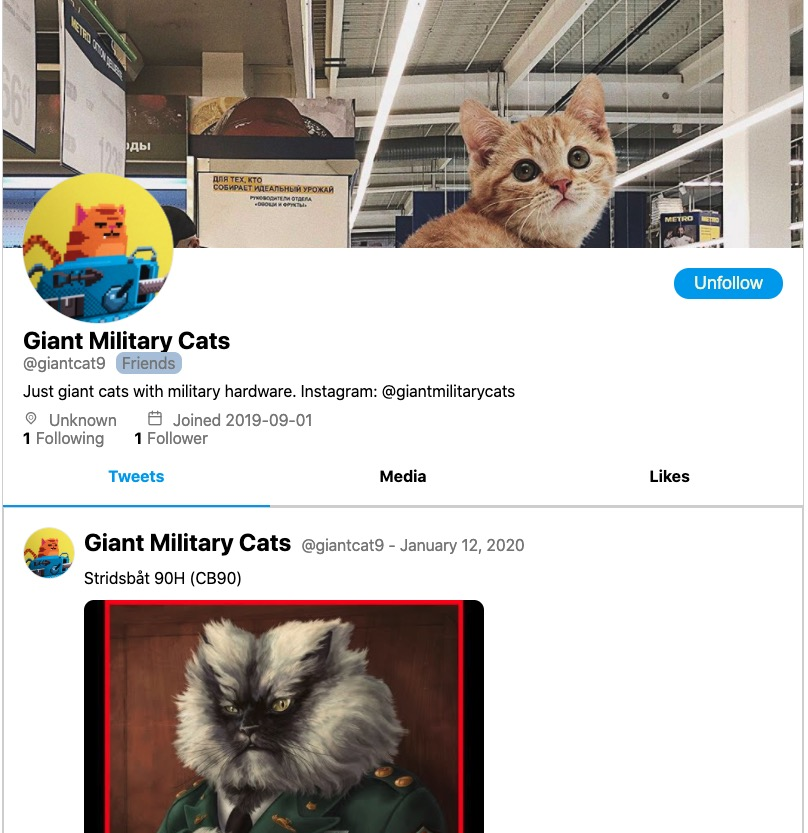
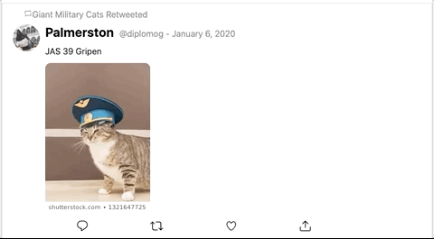
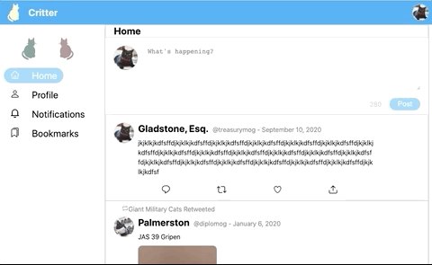
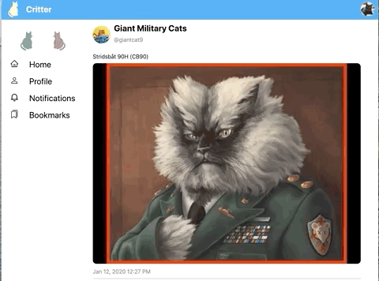
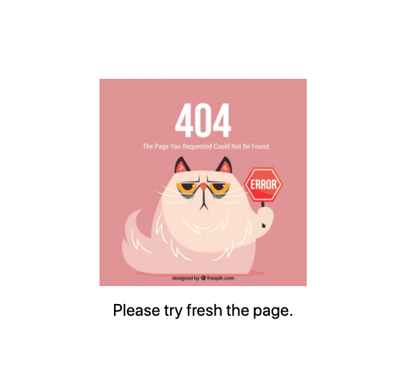

# Critter

React Twitter clone project which allows users to follow friends, view/like/retweet friends posts, post their own tweets, etc.

## Installation

### Server

1. Navigate to the server directory `cd server`
2. Install the required packages `yarn install`
3. Start server `yarn start:server`

:star: You can find instructions for running the server application in `serverAPI_/DOCS.md`

### Frontend

1. Navigate to the client directory `cd client`
2. Install the required packages `yarn install`
3. Start: `yarn start`

## Technologies

### Frontend

- React.js
- JavaScript
- Redux
- Styled Components
- React Srping

### Backend

- Node.js
- Express

## Features

### View a single tweet

### View a "home feed"

### View a profile page

### Liking/Retweeting a tweet

### Posting a new tweet

It should show up in the feed below after posting.

### Loading states

### Error page

## Contact

Created by [@Ning An](https://github.com/ning-an) - feel free to contact me!
